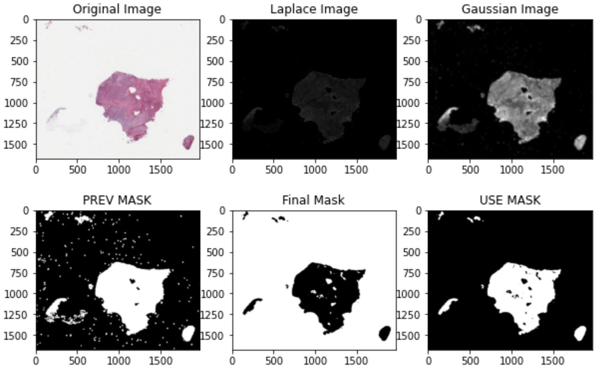
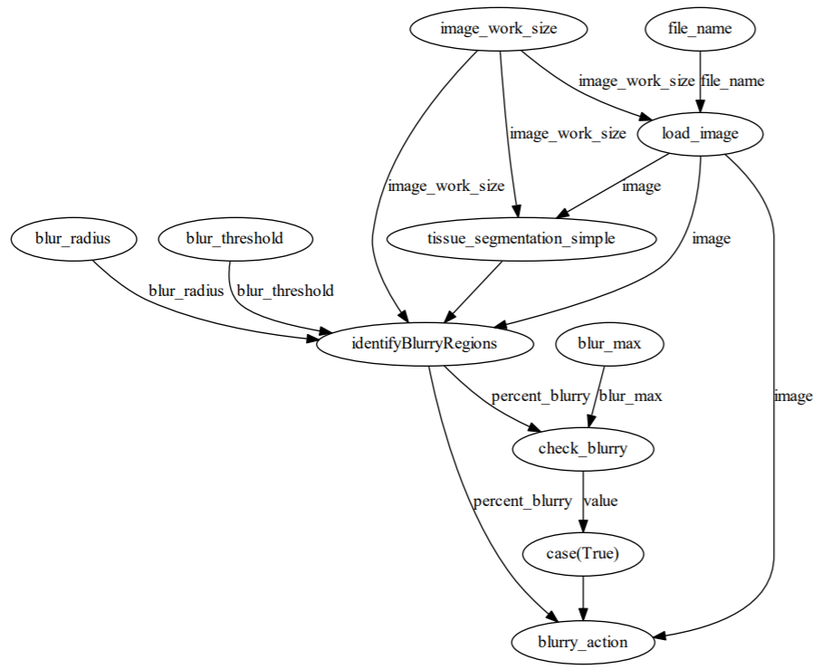
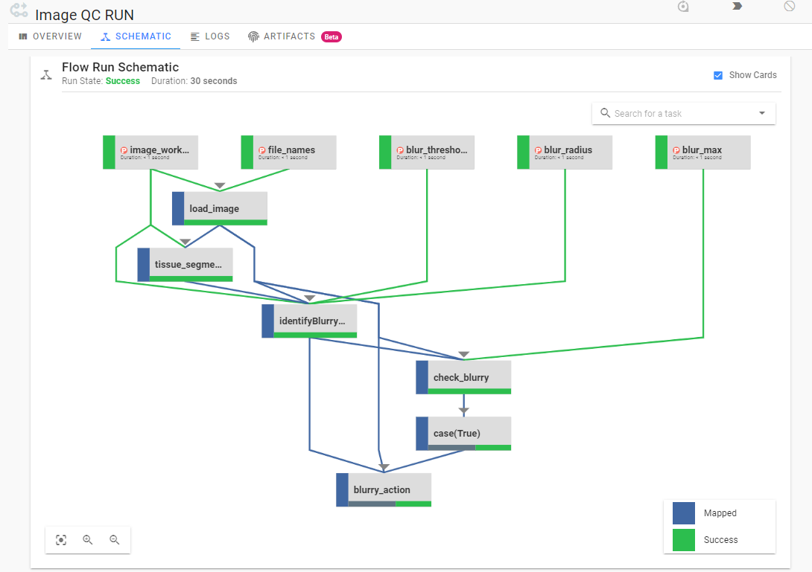
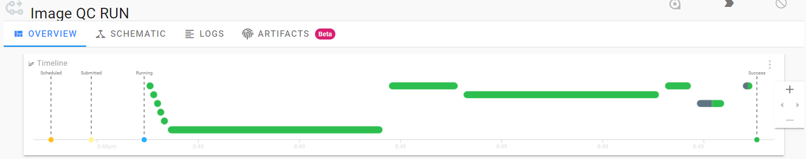

# Prefect for data pipelines in Python
Workshop materials for [Prefect](http://prefect.io/) for data pipelines in Python for the Research Bazaar Tucson, AZ 2021

#### Presentation
[](Presentation.pdf)

# Setup
0. Install Python 3.6+
    - Optionally: Install Docker with docker compose
1. Setup a virtual environment
2. Run in your environment: 
    
    `pip install -r requirements.txt`

3. Download the data using:
    - (preferably) `python get_data.py` 

    OR

    - [get_data.sh](get_data.sh)

    OR 

    - download manually from [Google Drive](https://drive.google.com/drive/folders/1chElMmxHgF83Gdqy4lUOHBmLpo_JZB19?usp=sharing)

4. If you will work with the Prefect server start the download of the server Docker files
    - `prefect backend server`
    - `prefect server start`

## Workshop: Getting started with Prefect
## Agenda
120 min total
Clock Time| Time | Segment Description
----------|------|--------------------
0:00-0:05 | 5    | Arrival
0:05-0:20 | 20   | Intro and Presentation
0:20-0:35 | 10   | Installation and setup (MUST DO! data takes time)
0:35-0:55 | 25   | Prefect hello world
0:55-1:00 | 5    | BREAK
1:00-1:10 | 10   | pipeline and image review
1:10-1:30 | 20   | pipeline to pipeline_prefect
1:30-1:40 | 10   | pipeline_prefect to pipeline_prefect_server
1:40-1:50 | 5    | review pipeline_prefect_parallel_server
1:50-2:00 | 10   | Wrap up

## Pipeline background
There are plenty of Prefect tutorials on ETL. The pipeline we use focuses on taking local data and processing it. Specifically taking images from a scanner, moving them to a shared drive and then quality checking (QC) those images.

The pipeline steps are an example of the QC that we do on our images. First loading the image, then finding the tissue in the image, and finally calculating the blur in the image. Image below contains steps in the process.

[](docs/pipeline_overview.png)
### Workshop Notes
0. Hello world in jupyter notebook on Colab
    - For Google Colab you will need a Google Account, or install jupyter and run the file locally
    - `pip install jupyter` and then `jupyter notebook` and then open [PrefectHelloWorld.ipynb](PrefectHelloWorld.ipynb)
    - To run in Colab open the link: [PrefectHelloWorld.ipynb](https://colab.research.google.com/drive/14ARQbAnXhNVZpIlt4pRHk2GTstkgjddK?usp=sharing#scrollTo=jMMGq2pcWlFg&forceEdit=true&sandboxMode=true)
1. Starting with [pipeline.py](pipeline.py) convert to Prefect flow.

    Steps:
    - import the necessary modules/functions: 
    `from prefect import Flow, task, Parameter, case
`
    - first convert each function to Prefect tasks with `@task` decorator
    - create the prefect flow with each task
    - add all parameters using `Parameter`
    - add `logger = prefect.context.get("logger")` to each function
    - use `case` to handle if statement with new function
    - `flow.run()` in the for loop
    - don't forget to use `upstream_tasks=[result]` to make sure `identifyBlurryRegions` waits for the `tissue_segmentation_simple` to complete

    Solution is: [pipeline_prefect.py](solutions/pipeline_prefect.py)
#### Flow visualization serial
[](docs/flow_serial.png)

2. Building on the pipeline_prefect solution, send information to server

    Steps:
    - import the necessary modules/functions: 
    `from prefect import Client`
    - register the flow `flow.register(project_name="Image QC")`
    - connect the client `client = Client()`
    - register the client `flow_id = client.register(flow=flow, project_name="Image QC")`
    - convert the flow from running directly with `flow.run()` to running with the client in the for loop
    ```python
    client.create_flow_run(
            flow_id=flow_id,
            run_name="Image QC RUN Serial",
            parameters=dict(
                file_name=file_name,
                image_work_size=image_work_size,
                blur_radius=blur_radius,
                blur_threshold=blur_threshold,
                blur_max=blur_max,
            ),
        )
    ```

    Solution is: [pipeline_prefect_server.py](solutions/pipeline_prefect_server.py)

### EXTRA
These are extra tasks that can be done if time is available

3. Building on the pipeline_prefect solution, parallelize tasks in flow.

    Steps:
    - import the necessary modules/functions: 
    `from prefect import apply_map, unmapped`
    - every task in the flow use `{task_name}.map()`
    - use `unmapped` for all parameters
    - move case into a separate function that will be mapped using `apply_map`
    - convert for loop to just pass in list of files to the flow

    Solution is: [pipeline_prefect_parallel.py](solutions/pipeline_prefect_parallel.py)

#### Flow visualization parallel
[](docs/flow_parallel.png)

4. Building on the pipeline_prefect_parallel solution, change executor to LocalDaskExecutor

    Steps:
    - import the necessary modules/functions: 
    `from prefect.executors import LocalDaskExecutor, LocalExecutor`
    - Set executor: `flow.executor = LocalDaskExecutor`

    Solution is: [pipeline_prefect_parallel.py](solutions/pipeline_prefect_parallel.py)

5. Building on the pipeline_prefect_parallel solution, set up Prefect server running
    Steps: Same as above for pipeline_prefect_server.py this can be done in separate order.
    - Solution is [pipeline_prefect_parallel_server.py](solutions\pipeline_prefect_parallel_server.py)

#### Flow visualization parallel in Prefect Server
[](docs/flow_schematic.png)

#### Flow timeline in Prefect Server
[](docs/flow_timeline.png)


## Notes for running comparison
A comparison of running the pipeline with different configurations. 

While the pure Python implementations are certainly faster, the benefits that Prefect provides in orchestration, monitoring, logging, etc are worth the extra execution time. There are also likely other optimizations that can be done.

Script  |       Type         | Execution Time   | File Run
------- |--------------------|------------------|----------
Prefect |    Parallel        | 20 seconds       | [pipeline_prefect_parallel.py](solutions/pipeline_prefect_parallel.py)
Prefect |    Parallel Dask   | 10 seconds       | [pipeline_prefect_parallel.py](solutions/pipeline_prefect_parallel.py)
Prefect |    Serial          | 23 seconds       | [pipeline_prefect.py](solutions/pipeline_prefect.py)
Python  |    Serial          | 15 seconds       | [pipeline.py](pipeline.py)
Python  |    Parallel        | 6 seconds        | [pipeline_parallel.py](pipeline_parallel.py)

## Prefect Setup for Local Server

Commands to get started with Prefect server running locally.

```
prefect backend server

prefect server start

# Run next two commands in separate terminals

prefect create project "Image QC"

prefect agent local start
```

## Prefect Setup for Cloud Server
- You need to get a key from: https://cloud.prefect.io/user/keys
- You will need to make a token: https://cloud.prefect.io/team/service-accounts
```
prefect backend cloud

prefect auth login -t {GET_YOUR_KEY}

prefect create project 'Hello, World!'
```

# Acknowledgements

- [HistoQC](https://github.com/choosehappy/HistoQC) - HistoQC is an open-source quality control tool for digital pathology slides
    - The [BaseImage.py](BaseImage.py) was modified from this as well as the [pipeline.identifyBlurryRegions](pipeline.py)
    - Images come from [http://histoqcrepo.com/](http://histoqcrepo.com/)
- [deep-histopath](https://github.com/CODAIT/deep-histopath)
    - [Apply filters for tissue segmentation](https://developer.ibm.com/technologies/data-science/articles/an-automatic-method-to-identify-tissues-from-big-whole-slide-images-pt2/)
        - Used to help create the [pipeline.tissue_segmentation_simple](pipeline.py)