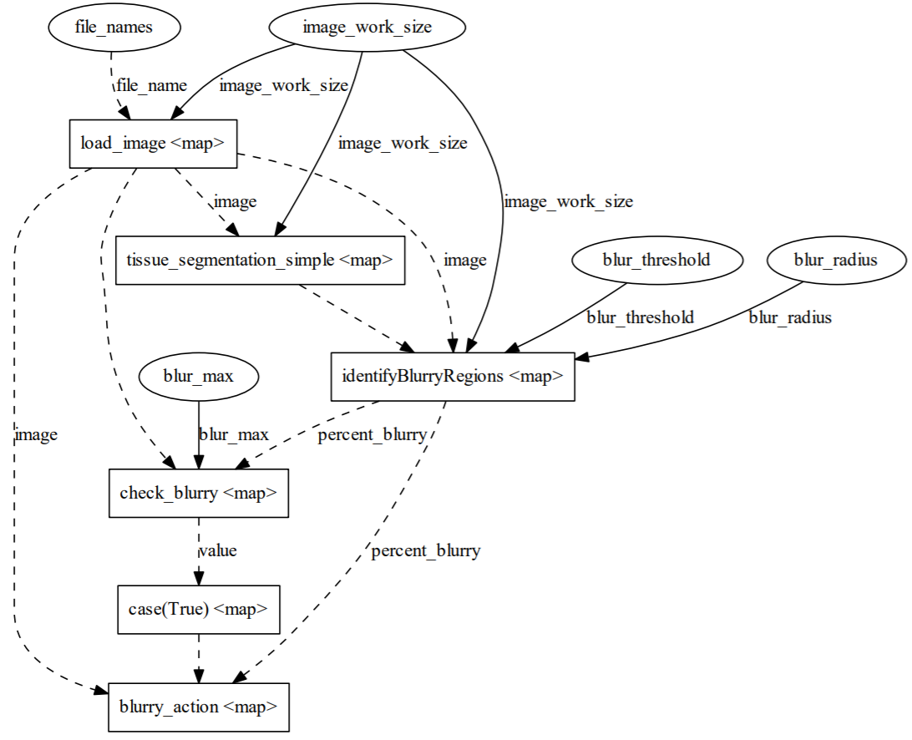

# Prefect for data pipelines in Python
Workshop materials for [Prefect](http://prefect.io/) for data pipelines in Python for the Research Bazaar Tucson, AZ 2021

#### Presentation
[](Presentation.pdf)

# Setup
0. Install Python 3.6+
    - Optionally: Install Docker with docker compose
1. Setup a virtual environment
2. Run in your environment: 
    
    `pip install -r requirements.txt`

3. Download the data using:
    - (preferably) `python get_data.py` 

    OR

    - [get_data.sh](get_data.sh)

    OR 

    - download manually from [Google Drive](https://drive.google.com/drive/folders/1chElMmxHgF83Gdqy4lUOHBmLpo_JZB19?usp=sharing)

4. If you will work with the Prefect server start the download of the server Docker files
    - `prefect backend server`
    - `prefect server start`

## Workshop: Getting started with Prefect
## Agenda
120 min total
Clock Time| Time | Segment Description
----------|------|--------------------
0:00-0:05 | 5    | Arrival
0:05-0:20 | 15   | Intro and Presentation
0:20-0:35 | 15   | Installation and setup
0:35-0:55 | 20   | Prefect hello world
0:55-1:00 | 5    | BREAK
1:00-1:10 | 10   | pipeline and image review
1:10-1:30 | 20   | pipeline to pipeline_prefect
1:30-1:40 | 10   | pipeline_prefect to pipeline_prefect_parallel
1:40-1:50 | 10   | run on local server with pipeline_prefect_parallel_server
1:50-2:00 | 10   | Wrap up

### Notes
0. Hello world in jupyter notebook on Colab
    - For Google Colab you will need a Google Account, or install jupyter and run the file locally
    - `pip install jupyter` and then `jupyter notebook` and then open [PrefectHelloWorld.ipynb](PrefectHelloWorld.ipynb)
    - To run in Colab open the link: [PrefectHelloWorld.ipynb](https://colab.research.google.com/drive/14ARQbAnXhNVZpIlt4pRHk2GTstkgjddK?usp=sharing#scrollTo=jMMGq2pcWlFg&forceEdit=true&sandboxMode=true)
1. Starting with [pipeline.py](pipeline.py) first convert functions to Prefect tasks and create a Prefect flow.
    - Solution is [pipeline_prefect.py](solutions/pipeline_prefect.py)
#### Flow visualization serial
[](docs/flow_serial.png)

2. Building on the pipeline_prefect solution, parallelize tasks in flow.
    - Solution is [pipeline_prefect_parallel.py](solutions/pipeline_prefect_parallel.py)

#### Flow visualization parallel
[](docs/flow_parallel.png)

3. Building on the pipeline_prefect_parallel solution, change executor to LocalDaskExecutor
    - Solution is [pipeline_prefect_parallel.py](solutions/pipeline_prefect_parallel.py)
4. Building on the pipeline_prefect_parallel solution, set up Prefect server running
    - Solution is [pipeline_prefect_parallel_server.py](solutions\pipeline_prefect_parallel_server.py)

#### Flow visualization parallel in Prefect Server
[](docs/flow_schematic.png)

#### Flow timeline in Prefect Server
[](docs/flow_timeline.png)


## Notes for running comparison
A comparison of running the pipeline with different configurations. 

While the pure Python implementations are certainly faster, the benefits that Prefect provides in orchestration, monitoring, logging, etc are worth the extra execution time. There are also likely other optimizations that can be done.

Script  |       Type         | Execution Time   | File Run
------- |--------------------|------------------|----------
Prefect |    Parallel        | 20 seconds       | [pipeline_prefect_parallel.py](solutions/pipeline_prefect_parallel.py)
Prefect |    Parallel Dask   | 10 seconds       | [pipeline_prefect_parallel.py](solutions/pipeline_prefect_parallel.py)
Prefect |    Serial          | 23 seconds       | [pipeline_prefect.py](solutions/pipeline_prefect.py)
Python  |    Serial          | 15 seconds       | [pipeline.py](pipeline.py)
Python  |    Parallel        | 6 seconds        | [pipeline_parallel.py](pipeline_parallel.py)

## Prefect Setup for Local Server

Commands to get started with Prefect server running locally.

```
prefect backend server

prefect server start

# Run next two commands in separate terminals

prefect create project "Image QC"

prefect agent local start
```

## Prefect Setup for Cloud Server
- You need to get a key from: https://cloud.prefect.io/user/keys
- You will need to make a token: https://cloud.prefect.io/team/service-accounts
```
prefect backend cloud

prefect auth login -t {GET_YOUR_KEY}

prefect create project 'Hello, World!'
```

# Acknowledgements

- [HistoQC](https://github.com/choosehappy/HistoQC) - HistoQC is an open-source quality control tool for digital pathology slides
    - The [BaseImage.py](BaseImage.py) was modified from this as well as the [pipeline.identifyBlurryRegions](pipeline.py)
    - Images come from [http://histoqcrepo.com/](http://histoqcrepo.com/)
- [deep-histopath](https://github.com/CODAIT/deep-histopath)
    - [Apply filters for tissue segmentation](https://developer.ibm.com/technologies/data-science/articles/an-automatic-method-to-identify-tissues-from-big-whole-slide-images-pt2/)
        - Used to help create the [pipeline.tissue_segmentation_simple](pipeline.py)